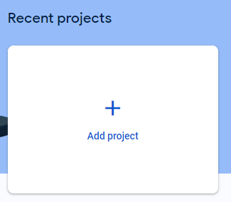
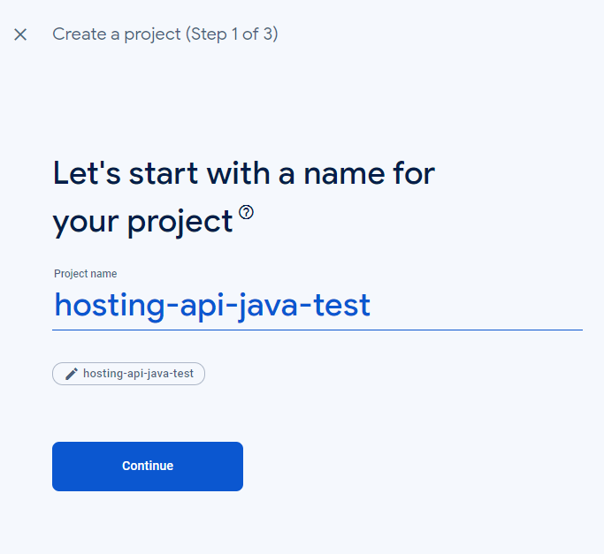
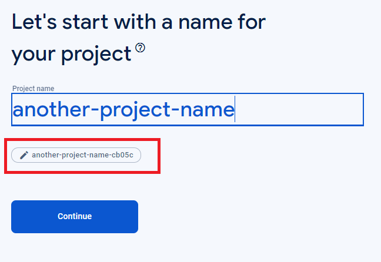
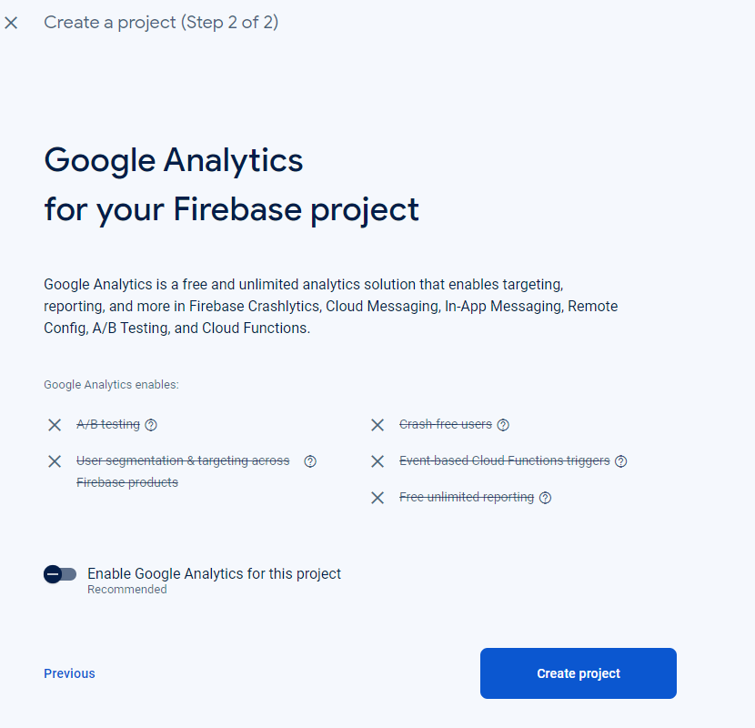
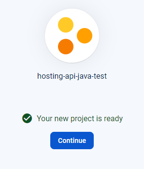
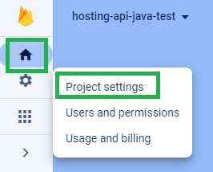
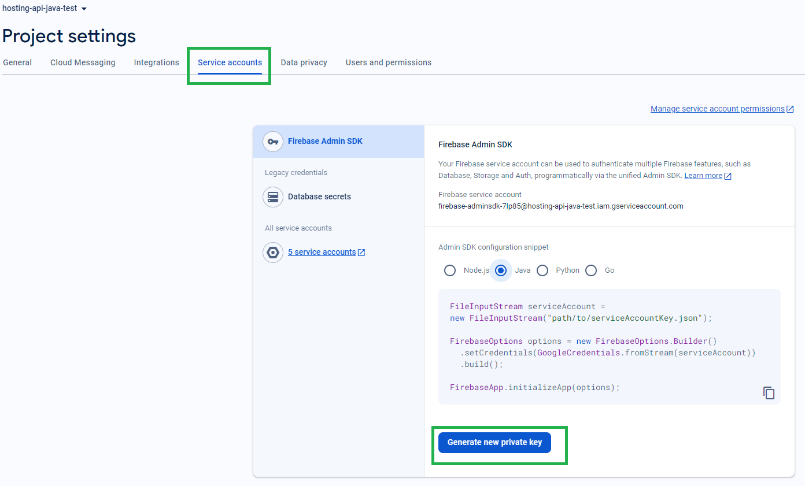
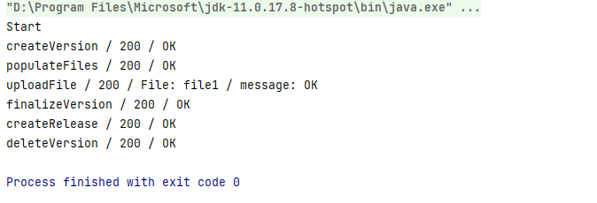
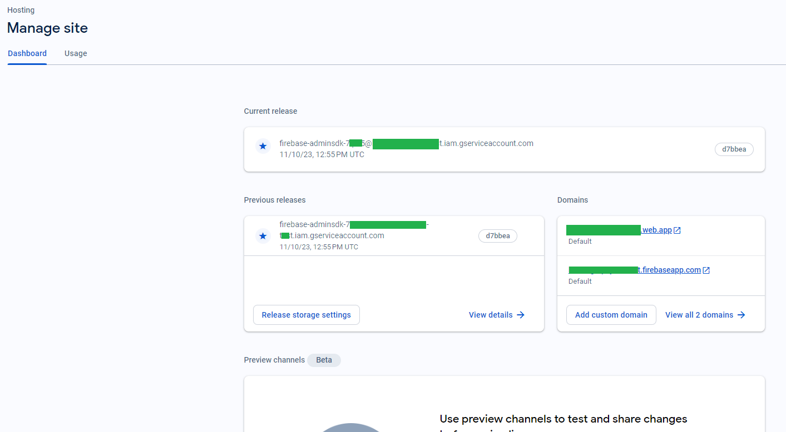

# Setting up a Firebase project with Firebase Hosting

This file contains a detailed guide how to create and configure a Firebase project with Hosting to use the **firebase-hosting-api-java** client library.

## Create a Firebase project in Firebase Console
Open https://console.firebase.google.com/u/0/ and press on "Add project":

Define a name for the project:

**REALLY IMPORTANT: If you define a non-unique name, then the project name and project id will be different**

Hint: You'll use the project ID as "siteId" in the library configuration:

Disable Analytics if you don't need it, then press "Create project":

Click on Project Settings:

Click on "Service accounts" panel then "Generate new private key":

Download the file and save it as "service-account.json" and save into "src/main/resources" folder.

Run the application, and you have to see many HTTP 200's. 

Then check your project in Firebase console:

**IMPORTANT:**
If you see non HTTP 200's, you might have some issues with your Google Cloud/Firebase account.