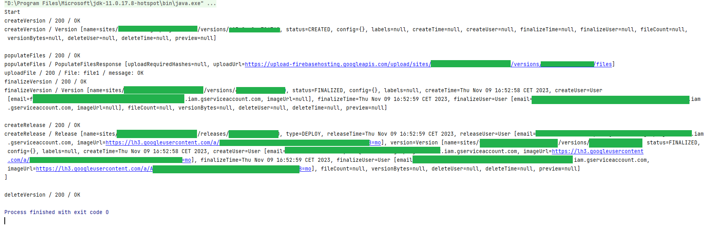

# firebase-hosting-api-java v0.6 example
This is a working example of firebase-hosting-api-java library with version 0.6. Version 0.6 is working, but with only some tradeoffs:

- siteName parameter should be the SITE_ID (this will be renamed in v0.7)
- configStream is the input of the service account JSON file (this will be renamed in v0.7)
- There's no validation for the mandatory input parameters (this will be solved in v0.7)

**IMPORTANT: **

- You will not see anything if you do not set any listener!
- Library does not catch all exceptions. The purpose of this approach is to give the control to your application instead of hiding and wrapping it.

Firebase setup:[link](../../FIREBASE_SETUP.md)

# Sample log messages

## With HTTP response listeners

## With HTTP and Service response listeners

