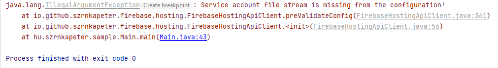
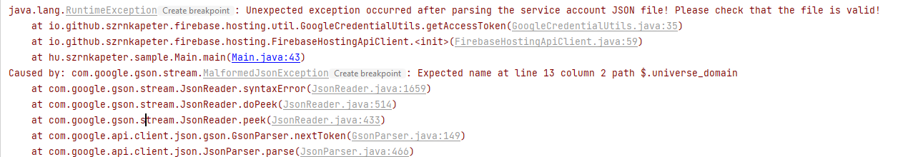
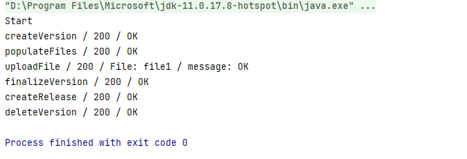
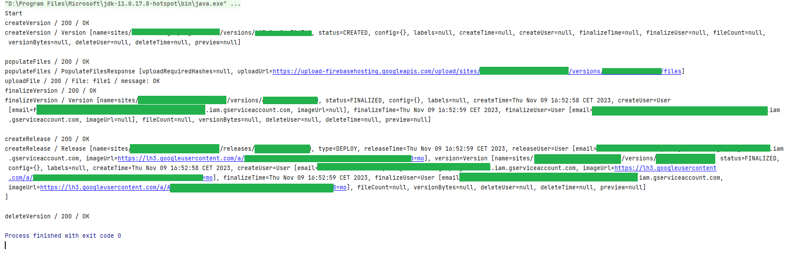

# firebase-hosting-api-java v0.7 example
This is a working example of firebase-hosting-api-java library with version **0.7**.

**Firebase setup:[link](../../FIREBASE_SETUP.md)**

**IMPORTANT:**
- You have to add a "service-account.json" file under src/main/resources folder!
- You will not see anything if you do not set any listener!
- Library does not catch all exceptions. The purpose of this approach is to give the control to your application instead of hiding and wrapping it.

# Sample log messages

## Missing service account file:

## Invalid service account file:

## With HTTP response listeners

## With HTTP and Service response listeners

